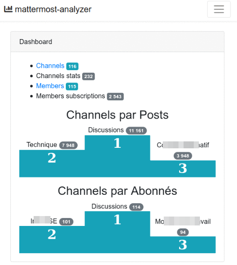

# Mattermost analyzer

WIP on a Mattermost usage analyzer.



Access to Mattermost API done with [thePanz/MattermostClient](https://github.com/thePanz/MattermostClient).

## Run

checkout the code

$ git clone git@github.com:Cyrille37/mattermost-analyzer.git

configure `.env file`. Important entries are `DB_*` and `MATTERMOST__*`

create database

`$ mysqladmin -u <user> -p create <database>`

install dependencies

`$ composer install --no-dev`

create tables

`$ ./artisan migrate`

fill data

`$ ./artisan mma:browseServer`

view data

`$ ./artisan serve`

browse at http://127.0.0.1:8000

## Tech

```php
// a Datetime from a milliseconds timestamp
echo (Carbon::createFromTimestampMs(1717579823989))->toDateString(), "\n" ;
```
